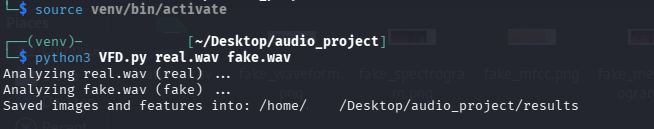
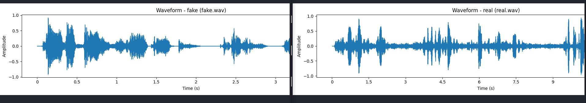
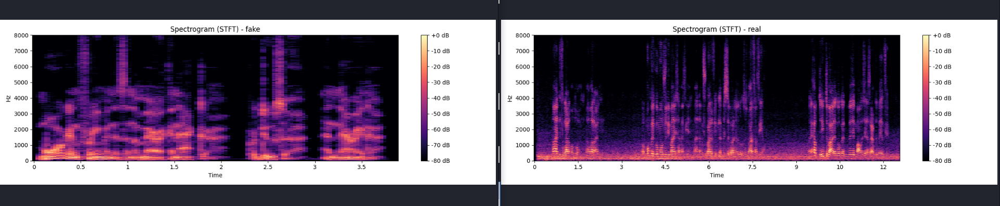
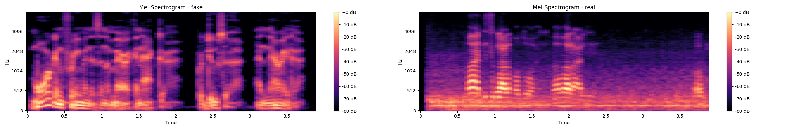
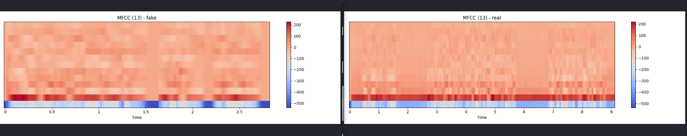
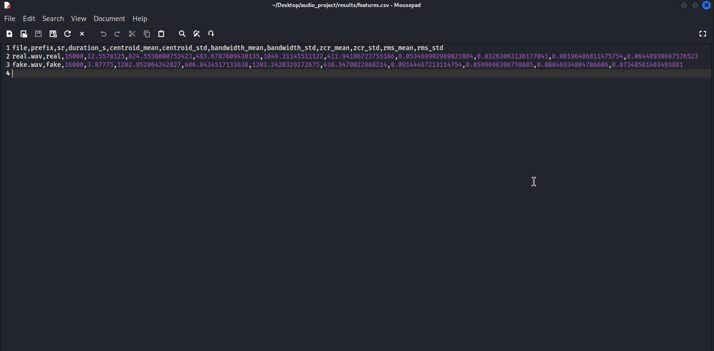

# Real vs Fake Voice – Voice Fake Detective

A lightweight audio-forensics tool that prepares audio files for numerical analysis and extracts measurable features to help distinguish real human speech from AI-generated voices.

---

##  1. Create & Activate Python Virtual Environment

To isolate project dependencies:

```bash
python3 -m venv venv
source venv/bin/activate
pip install numpy matplotlib librosa soundfile pandas
```


##  2. Audio Pre-Processing (FFmpeg)

To ensure consistent analysis, all audio files are converted to:

-WAV
-16 kHz sample rate
-Mono channel

Convert AI-generated audio:

```bash
ffmpeg -i fakeyou.mp3 -ar 16000 -ac 1 fake.wav
```

Convert real WhatsApp voice note:

```bash
ffmpeg -i real.opus -ar 16000 -ac 1 real.wav
```


##  3. Run the Analysis Script

Execute the Python tool with:
```bash
python3 VFD.py real.wav fake.wav
```




## 4. Output Files

The script generates multiple analysis results inside the results/ folder, including:

- Waveform comparison
- Spectrogram
- MFCC
- STFT
- CSV feature report








## Summary

This repository demonstrates a simple workflow for audio forensic analysis by:

- Normalizing audio inputs
- Extracting numerical features
- Visualizing differences between real vs AI-generated voices

Useful for multimedia projects, digital forensics, and cybersecurity research.
